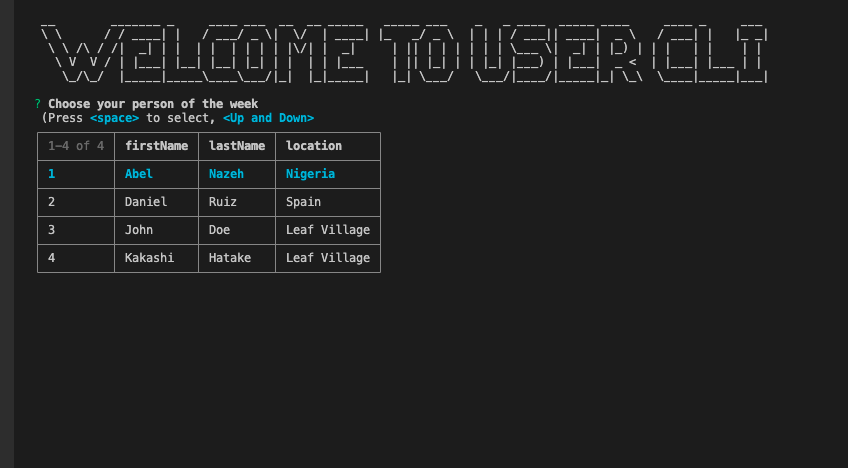

# inquirer-selectable-table [](https://badge.fury.io/js/inquirer-selectable-table)

> A selectable table-like prompt for [Inquirer.js](https://github.com/SBoudrias/Inquirer.js)




## Installation

```shell
npm install --save @biggerstar/inquirer-selectable-table

```

## Usage

After registering the prompt, set any question to have `type: "table"` to make use of this prompt.

The result will be an array, containing the value for each row.

```js
inquirer.registerPrompt("table", require("inquirer-selectable-table"));

inquirer
  .prompt([
    {
      type: "table",
      name: "people",
      message: "Choose your person of the week",
      columns: [
        {
          name: "firstName",
          value: "firstName",
        },
        {
          name: "lastName",
          value: "lastName",
        },
        {
          name: "location",
          value: "location",
        },
      ],
      rows: [
        {
          firstName: "Abel",
          lastName: "Nazeh",
          location: "Nigeria",
        },
        {
          firstName: "Daniel",
          lastName: "Ruiz",
          location: "Spain",
        },
        {
          firstName: "John",
          lastName: "Doe",
          location: "Leaf Village",
        },
        {
          firstName: "Kakashi",
          lastName: "Hatake",
          location: "Leaf Village",
        },
      ],
    },
  ])
  .then((answers) => {
    console.log(answers);
  });
```

### Options

- `columns`: Array of options to display as columns. Follows the same format as Inquirer's `choices`
- `rows`: Array of options to display as rows. Follows the same format as Inquirer's `choices`
- `pageSize`: Number of rows to display per page
